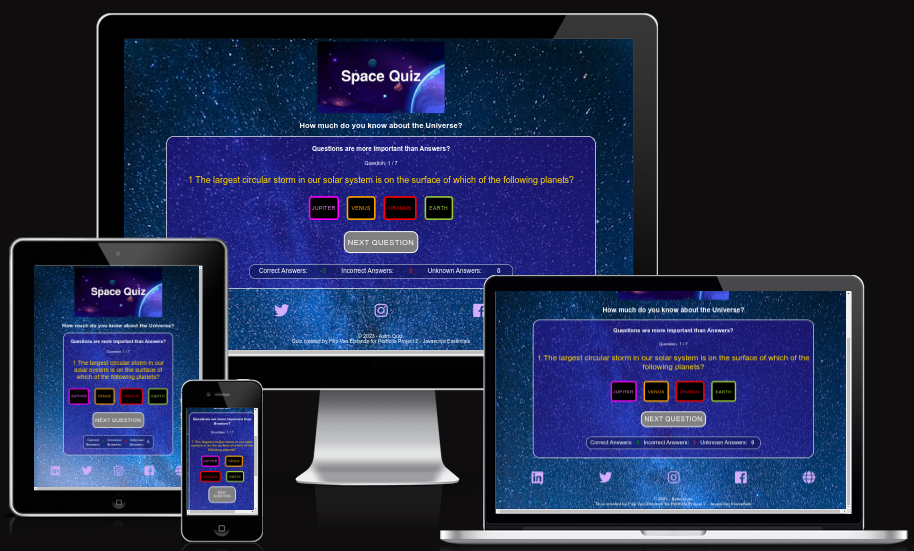
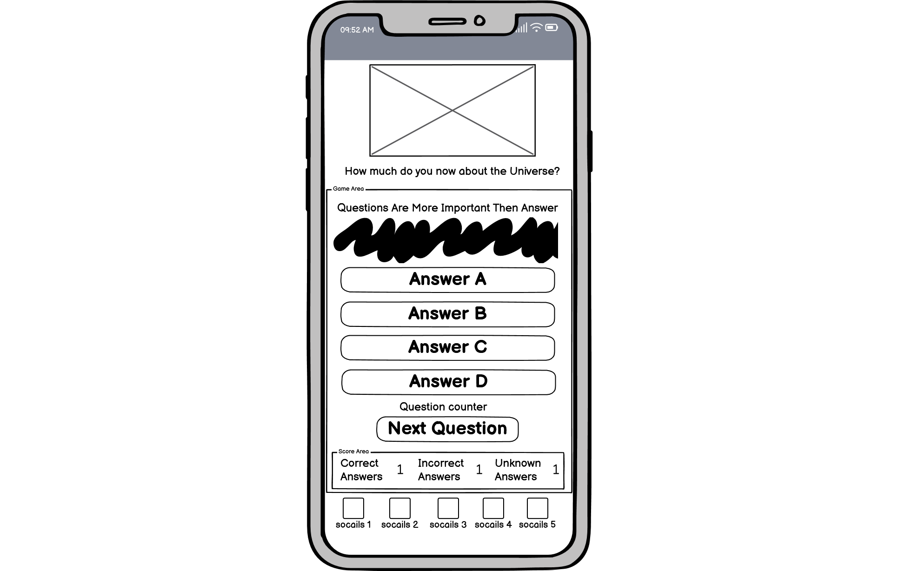
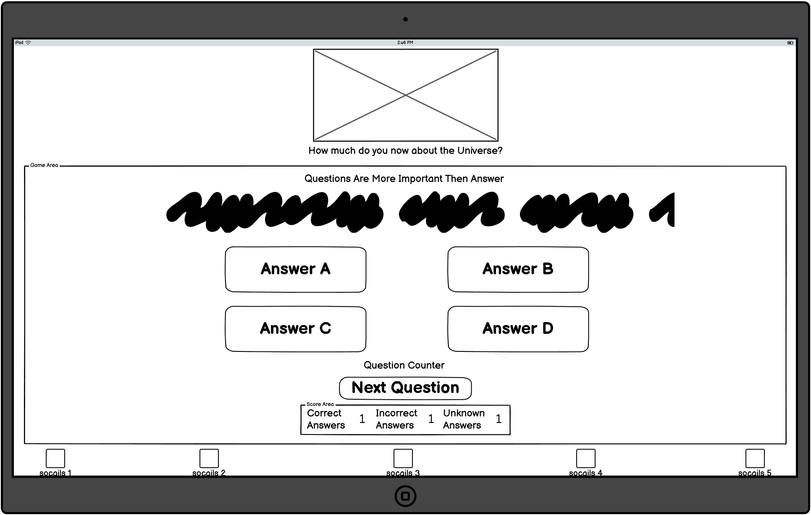
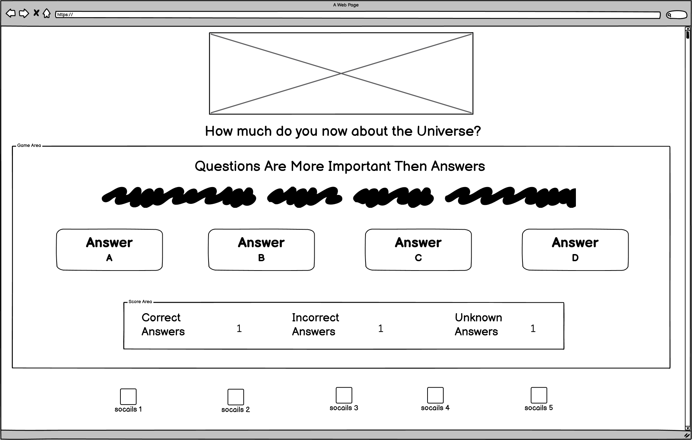
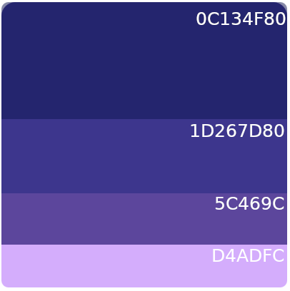
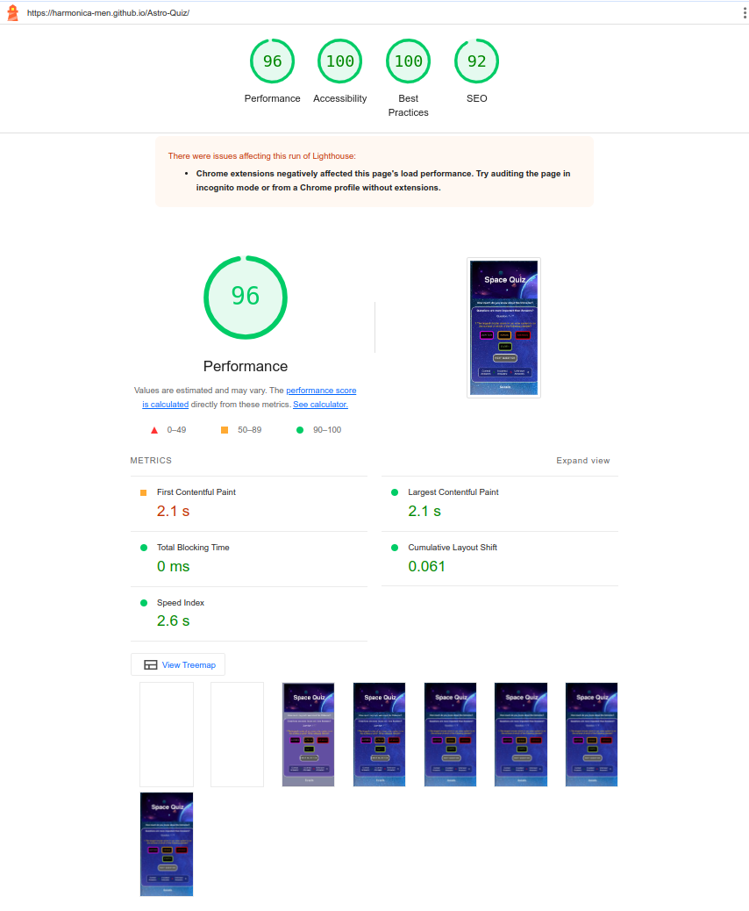
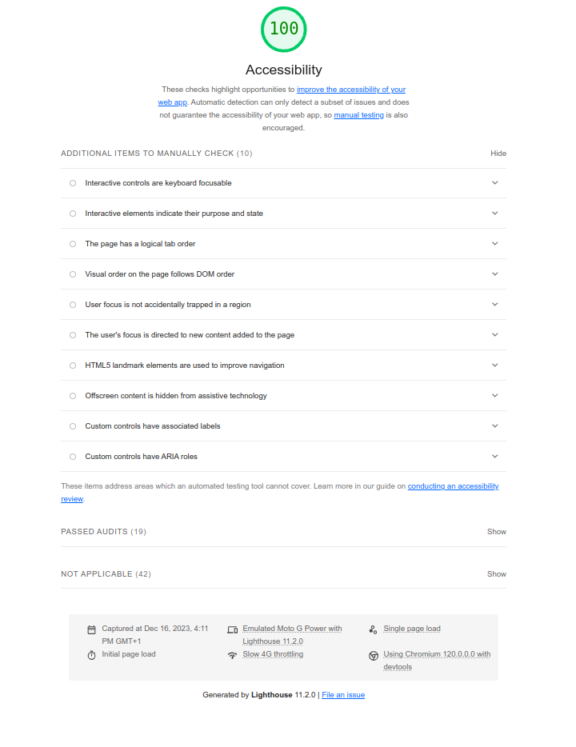

# Astro-Quiz

How much do you know about the Universe?

This little quiz is designed to give you the answer to that question. The main goal is to test your knowledge about astronomical subjects.
For demonstration purposes, this quiz is limited to seven questions.
Regardless of the difficulty level of the questions, the audiences of different ages can be targeted.

## Intro

## UX
Because this is a multiple-choice question method.
(A multiple-choice item consists of a problem, known as the stem, and a list of suggested solutions, known as alternatives.)

The user knows in advance that at least one choice is correct.
Even with deductive reasoning, the answers can be guessed because there is only one best answer.

There are actual counters built in to keep track of the correct and incorrect answers, and the questions that are unanswered are also counted.

## User Story
In classical multiple-choice game play, points are granted for correct answers, and if answers are wrong, points can be penalized.
When answers are not given, there are no points to be gained.

## Features 
* All buttons in the game-area have nice hover effects and have a good background contrast. 
* Socails links to all major media platforms.
* A counter in the game-area to see the progress of player.
* To have an instant game score of correct, wrong and skipped answers.
* A thumbs-up indicator to acknowledge the player (include fade effect)
* An alert box pops up when an answer is wrong. Give the correct answer to learn from the mistake.
* If the question is skipped, a pop-up box gives the correct answer.
* If all questions are answered, the player is given the choise to play the game again.

## Wireframe
The design is made different media device

- smartphone
  

- tablet
  

- desktop
  

## Features to be implemented?
If a JSON build input is implemented, it can potentially be added to provide more questions.

Timer is required to level up the User Experience and higher cognitive thinking is required.

## Technologies Used

### Languages

- HTML
  - Page markup.
- CSS
  - Styling.
- JS
  - Javascript code for gameplay.

### Tools
- Google Fonts
  - Is this project the font _Roboto_ was choosen in [GoogleFonts](https://fonts.google.com/specimen/Roboto)
- Favicon
  - In Flaticon the Saturn favicon was used [favicon](https://www.flaticon.com/free-icon/saturn_5005667?related_id=5005667)
    
  

- Colors
  - The Color scheme comes from [colorhunt](https://colorhunt.co/)
  
  

### Other Tools

- Wireframe where used be [Balsamiq](https://balsamiq.com/wireframes/)
- Favicon added be Favicons

This site was built using [GitHub Pages](https://pages.github.com/)

### Manual Testing
The overall performence test on Lighthouse (dev-tools) has a 97% score 

As we go in detail of the Accessibility

Validator Testing
HTML
No errors were returned when passing through the official W3C validator

CSS
No errors were found when passing through the official (Jigsaw) validator

* HTML has been validated with the W3C HTML5 Validator.

* CSS has been validated with the W3C CSS Validator and auto-prefixed with the CSS Autoprefixer.
* Links are checked with the W3C Link Checker.
* Each JavaScript file was tested on the site for errors and functionality using the console and JSHint.
* There seems to be an issue of the functions of the DOM EventListner, theoretically I could this outside the function, but I can be difficult to handle the 'click' button events individually.
* To have control over the array (list of questions) from the beginning to end, there was a need for flow control over 'currentQuestion' counter. Therefor it was necessary to set this value explicit to either 0 or -1. 
* When 'currentQuestion' value is at maximum value of the data array an exception has to introduce to the Event Lister to handle the documents Elements differently either hiding them or show them in the game-area container. 
* This same 'trick' is also implied into the buttons of the options choices, here JS is handle them as an object with for example button option 'A' and  inner text empty by initialization but when DOM elements are loaded each option button retrieve the values of the current data array. 

## Deployment
There is already a life version online running on the GitHub, [Here](https://harmonica-men.github.io/Astro-Quiz/) the repo is located [here](https://github.com/Harmonica-Men/Astro-Quiz)

### For Deployment over the Internet
- make a deticated Ubuntu Linux Server (latest version can be downloaded) here - [download](https://ubuntu.com/download/server)
- go via the SSH-protocol to your local linux webserver and install the lastest Apache2 webserver [download](https://httpd.apache.org/download.cgi) or use the 'sudo apt install apache2' command.
- Make sure that apache2 services is running on the local server! check whit command 'sudo systemctl status apache2'
- go 'www' directory and copy via the SCP-protocol a copy of github repository into the your local 'www' directory.
- a detailed step by step guide: How To Download GitHud Repo, can be found [here](https://www.gitkraken.com/learn/git/github-download#how-to-download-a-github-repository)
- make sure that 'index.html' file and the corresponding directory hierachy is present in this directory 'www'
- restart the apache2 service (reload webserver) 'sudo systemctl restart apache2'
- goto your browers and type the specific IP-address or domain-name of your web-server and access the web page.
- If everything goes well and routed correctly to your network, the website is now published on the internet.

## Credits
- I love maths PP2 - code institute - guidelines - Here I used the Eventlistener and mofied the code for it to work for multiple choise questions.
  - DOM Elements & Event Listener
  - Buttons and layout
- [geekforgeeks](https://www.geeksforgeeks.org/how-to-create-a-simple-javascript-quiz/) - a guide to help me get started with creating a quiz.
- [W3Schools](https://www.w3schools.com/html/)
  Sitepoint - a guide to help me get started with creating a quiz.
- [pexels](https://www.pexels.com/search/images%20free%20download/): background image and banner, free online pictures libary.
- The Science Bowl Questions and Answers ASTR-91: [PDF](https://www.csun.edu/science/ref/games/questions/97_astr.pdf)  quiz questions & answers
- [Favicon](https://www.flaticon.com/free-icons/saturn) free online favicons libary.
