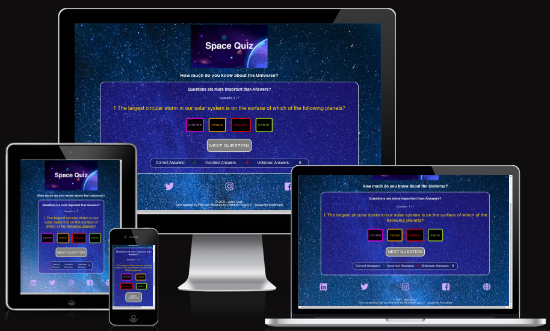
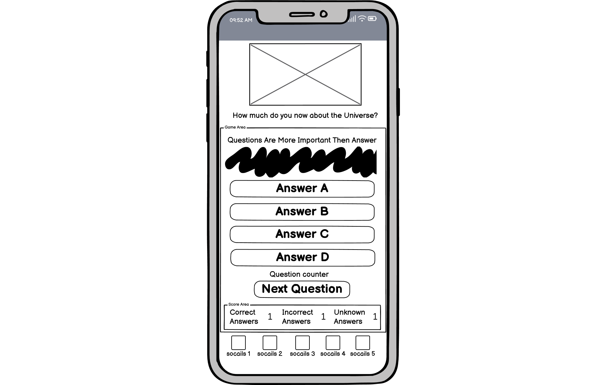
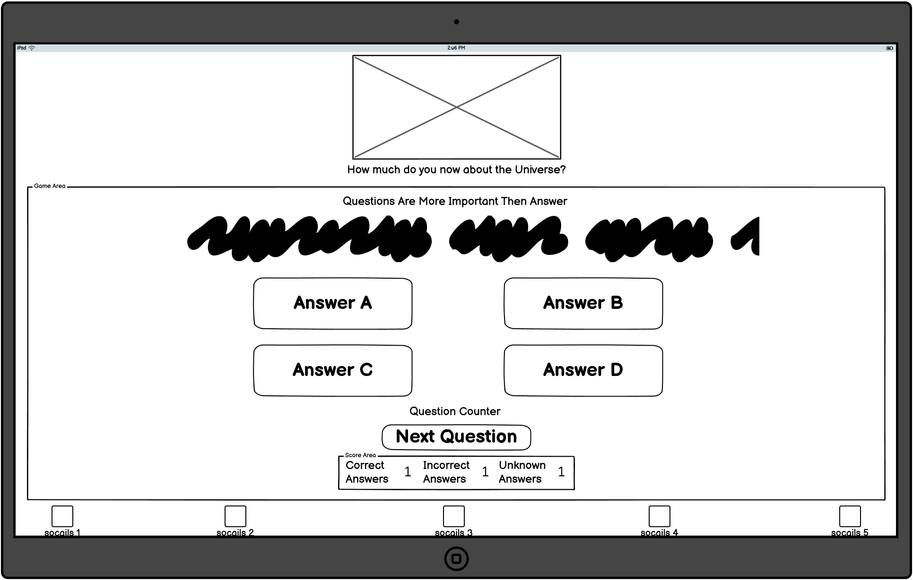
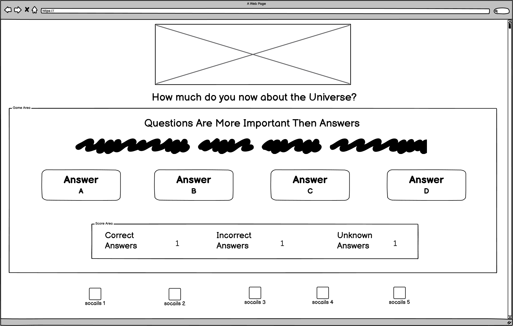

# Astro-Quiz
How much do you know about the Universe?
This little quiz is designed to give you the answer to that be multiple choise. The main goal is to test your knownlegde about astromical subjects.
For demonstration propose this quiz is limited to seven question. 
Regardless of the difficult level of the questions, the audiences of different ages can be targeted. 

## Intro

project desscription
purpose motivation
user demographic

What, why & who 

right expectations
project purpose
target audience

## UX
Because this a multiple question method. 
(A multiple choice item consists of a problem, known as the stem, and a list of suggested solutions, known as alternatives.)

The user knows at forehand at least one choise is correct.
Even with dutectieve reasoning the answers can be gueste of witch there is only one best answer.

There actual counters build in to keep track of the correct and incorrect answers also the questions that are unanswerd are counted. 

## user story

In classical game play of multiple-choise, points are granted to correct answers and if answers are wrong points can be pentaltied.
When answers are not given there are points to be gain.

## Features/Heading
The answer are embbeded into multple-choise buttons to give a more smooth user experience

As extra feature socails are build in to external links and media platforms.

## Responsiveness 
The responsiveness is tested for different media device
* smartphone

* tablet

* desktop

## Features to be implemented?
A JSON build input entry can potential be added to provide more questions into the Quiz.

Timer, to level up the User Experience and higher cognitive thinking is required.

## Technologies Used
### Languages
* HTML
    * Page markup
* CSS
  * Styling.
* JS
  * Javascript / gameplay
 Google Fonts
* Font Styles.
* Fontawesome
* Github

### Other Tools
* Wireframe where used be [Balsamiq](https://balsamiq.com/wireframes/)
 * Favicon added be Favicons

This site was built using [GitHub Pages](https://pages.github.com/)

Mockup Generator
For device mockup images.
Coolors
Creating color pallettes.

### Manual Testing
Methods
Validation
HTML has been validated with W3C HTML5 Validator.

CSS has been validated with W3C CSS Validator and auto-prefixed with CSS Autoprefixer.

Links checked with W3C Link Checker.

Each javascript file was tested on the site for errors and functionality using the console and with JSHint.

General Testing
"Sed ut perspiciatis unde omnis iste natus error sit voluptatem accusantium doloremque laudantium, totam rem aperiam, eaque ipsa quae ab illo inventore veritatis et quasi architecto beatae vitae dicta sunt explicabo. Nemo enim ipsam voluptatem quia voluptas sit aspernatur aut odit aut fugit, sed quia consequuntur magni dolores eos qui ratione voluptatem sequi nesciunt. Neque porro quisquam est, qui dolorem ipsum quia dolor sit amet, consectetur, adipisci velit, sed quia non numquam eius modi tempora incidunt ut labore et dolore magnam aliquam quaerat voluptatem. Ut enim ad minima veniam, quis nostrum exercitationem ullam corporis suscipit laboriosam, nisi ut aliquid ex ea commodi consequatur? Quis autem vel eum iure reprehenderit qui in ea voluptate velit esse quam nihil molestiae consequatur, vel illum qui dolorem eum fugiat quo voluptas nulla pariatur?"
Bugs
Known Bugs

## Deployment
### For Local Deployment
Local Preparation

Requirements:

* Any modern IDE of would work, but in this example I use the most popular today: Visual Studio Code 
* Git Git is standard on the latest linux distribution in case your using Windows you need to Download the Git Repo.

### Local Instructions

Download a copy of the project repository here and extract the zip file to your base folder. Or you can clone the repository with:
git clone https://github.com/Ri-Dearg/neverlost-thrift

## Credits
* i love maths PP2 - code institute - guidelines
   * DOM Elements & Event Listener
   * 

* https://www.geeksforgeeks.org/how-to-create-a-simple-javascript-quiz/  - a guide to help me get started with creating a quiz.
* W3Schools:
Sitepoint - a guide to help me get started with creating a quiz.
* pexels:  background image and banner
* Science Bowl Questions and Answers
   ASTR-91; Short Answer: Elliptical, Spiral and Irregular are classifications of what type of astronomical systems? ANSWER: GALAXIES. Page 10. Science Bowl.
* PDF https://www.csun.edu/science/ref/games/questions/97_astr.pdf quiz questions 
* Favicon https://www.flaticon.com/free-icons/saturn

## Content
Science Bowl Questions and Answers
   ASTR-91; Short Answer: Elliptical, Spiral and Irregular are classifications of what type of astronomical systems? ANSWER: GALAXIES. Page 10. Science Bowl.

