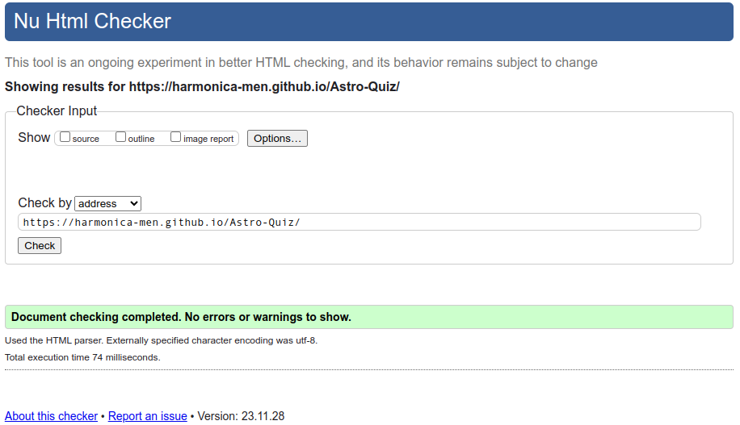

# Astro-Quiz

How much do you know about the Universe?

This little quiz is designed to give you the answer to that question. The main goal is to test your knowledge about astronomical subjects.
For demonstration purposes, this quiz is limited to seven questions.
Regardless of the difficulty level of the questions, the audiences of different ages can be targeted.

## Intro

## UX
Because this is a multiple-choice question method.
(A multiple-choice item consists of a problem, known as the stem, and a list of suggested solutions, known as alternatives.)

The user knows in advance that at least one choice is correct.
Even with deductive reasoning, the answers can be guessed because there is only one best answer.

There are actual counters built in to keep track of the correct and incorrect answers, and the questions that are unanswered are counted.

## User Story
In classical multiple-choice game play, points are granted for correct answers, and if answers are wrong, points can be penalized.
When answers are not given, there are points to be gained.

## Features/Heading
The answers are embedded into multiple-choice buttons to give a more smooth user experience

As an extra feature, social media links are built into external links and other media platforms.

## Wireframe
The design is made different media device

- smartphone
  

- tablet
  

- desktop
  

## Features to be implemented?
If a JSON build input is implemented, it can potentially be added to provide more questions.

Timer is required to level up the User Experience and higher cognitive thinking is required.

## Technologies Used

### Languages

- HTML
  - Page markup
- CSS
  - Styling.
- JS
  - Javascript code for gameplay

### Tools
- Google Fonts
  - Is this project the font _Roboto_ was choosen in [GoogleFonts](https://fonts.google.com/specimen/Roboto)
- Favicon
  - In Flaticon the Saturn favicon was used [favicon](https://www.flaticon.com/free-icon/saturn_5005667?related_id=5005667)
    
    

- Colors
  - The Color scheme comes from [colorhunt](https://colorhunt.co/)
  
  

### Other Tools

- Wireframe where used be [Balsamiq](https://balsamiq.com/wireframes/)
- Favicon added be Favicons

This site was built using [GitHub Pages](https://pages.github.com/)

### Manual Testing
The overall performence test on Lighthouse (dev-tools) has a 97% score 

Validator Testing
HTML
No errors were returned when passing through the official W3C validator

CSS
No errors were found when passing through the official (Jigsaw) validator

HTML has been validated with the W3C HTML5 Validator.

CSS has been validated with the W3C CSS Validator and auto-prefixed with the CSS Autoprefixer.

Links are checked with the W3C Link Checker.

Each JavaScript file was tested on the site for errors and functionality using the console and JSHint.

## Deployment

### For Local Deployment
Local Preparation

Requirements:
- Any modern IDE of would work, but in this example I use the most popular today: Visual Studio Code
- Git is standard on the latest linux distribution in case your using Windows you need to download the Git Repo.

### Local Instructions
On 
Download a copy of the project repository here and extract the zip file to your base folder. Or you can clone the repository with:
git clone https://github.com/Ri-Dearg/neverlost-thrift

## Credits

- I love maths PP2 - code institute - guidelines

  - DOM Elements & Event Listener
  - Buttons and layout

- https://www.geeksforgeeks.org/how-to-create-a-simple-javascript-quiz/ - a guide to help me get started with creating a quiz.
- W3Schools:
  Sitepoint - a guide to help me get started with creating a quiz.
- pexels: background image and banner
- Science Bowl Questions and Answers
  ASTR-91; Short Answer: Elliptical, Spiral and Irregular are classifications of what type of astronomical systems? ANSWER: GALAXIES. Page 10. Science Bowl.
- PDF https://www.csun.edu/science/ref/games/questions/97_astr.pdf quiz questions
- Favicon https://www.flaticon.com/free-icons/saturn

